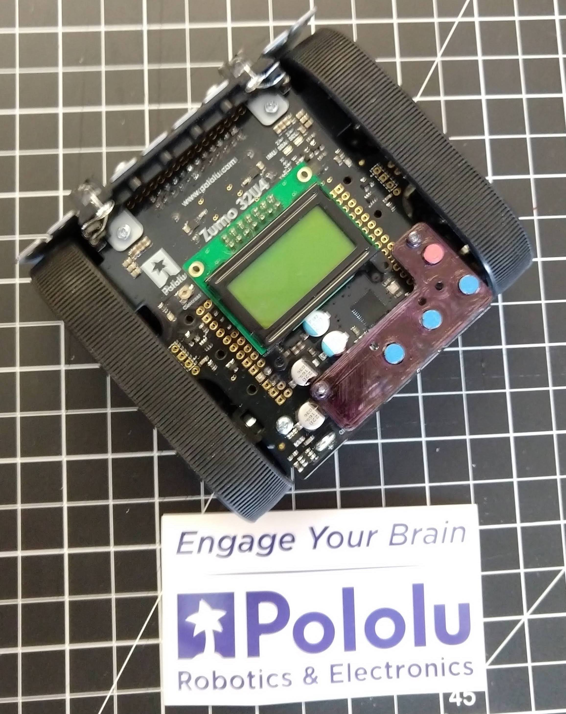
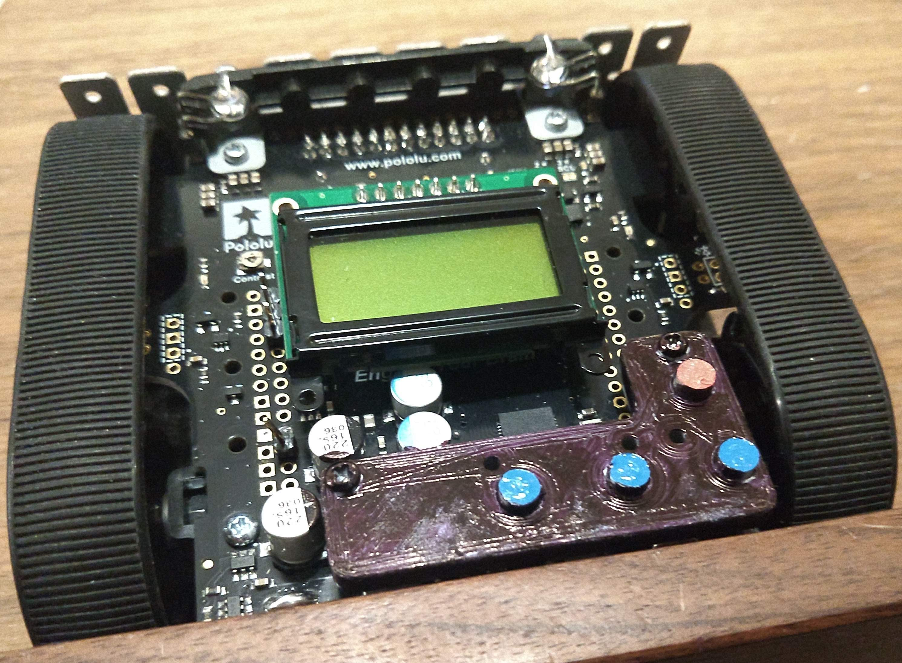

## Zumo Bigger Buttons

The purpose of this project is to add bigger buttons to the excellent Pololu Zumo 32u4 educational robot platform.

# How do I get bigger buttons?

The .stl files below are suitable for 3D printing with most standard filament-based printers. We have tested the files with the Ultimaker Three.

# What if I want to help?

The Fusion 360 .f3d files are provided. If you make changes and would like to share, please let us know!

# Images of Bigger Buttons in Action

